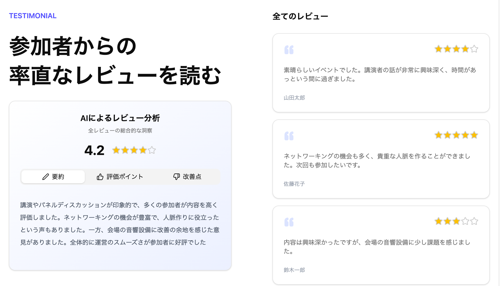

# 📊 User Review Analysis App (Learning Purpose)

An AI-powered web app for analyzing and summarizing user reviews.

This app is based on the hands-on session project from [Blueberry Mojito](https://b13o.com/), a React learning community. 
The code includes some modifications and enhancements made by me for personal learning purposes, such as:

- Integrating the Google Sheets API to fetch user reviews data.
- Using SWR for user review API requests.
- Adding fallback UI for loading and error states during API requests.

> [!NOTE]
> This repository is for personal learning and demonstration purposes only.

## 🚀 Features

- Display a list of user reviews.
- Summarize user reviews using AI.

## 🛠️ Built With

- [Vite](https://vite.dev/)
- [React](https://react.dev/)
- [Bun](https://bun.sh/)
- [Tailwind CSS](https://tailwindcss.com/)
- [shadcn/ui](https://ui.shadcn.com/)
- [SWR](https://swr.vercel.app/)
- [Google Sheets API](https://developers.google.com/sheets/api)
- [Gemini API](https://aistudio.google.com/)

## 📸 Demo

> (★ デプロイURLがあればここにリンクとスクリーンショットを載せるとさらに良いです)

[View Demo Site](https://demo-ai-review-analysis-app.pages.dev/)

<picture width="100%" height="auto" loading="lazy">
  <source
    srcset="./public/screenshot.webp" 
    type="image/webp" />
  
</picture>

## 📚 Learning Purpose

This project was created as part of my personal learning journey in modern React development, API integration, and AI service utilization.  
It demonstrates basic data fetching, UI/UX considerations, and third-party API usage.